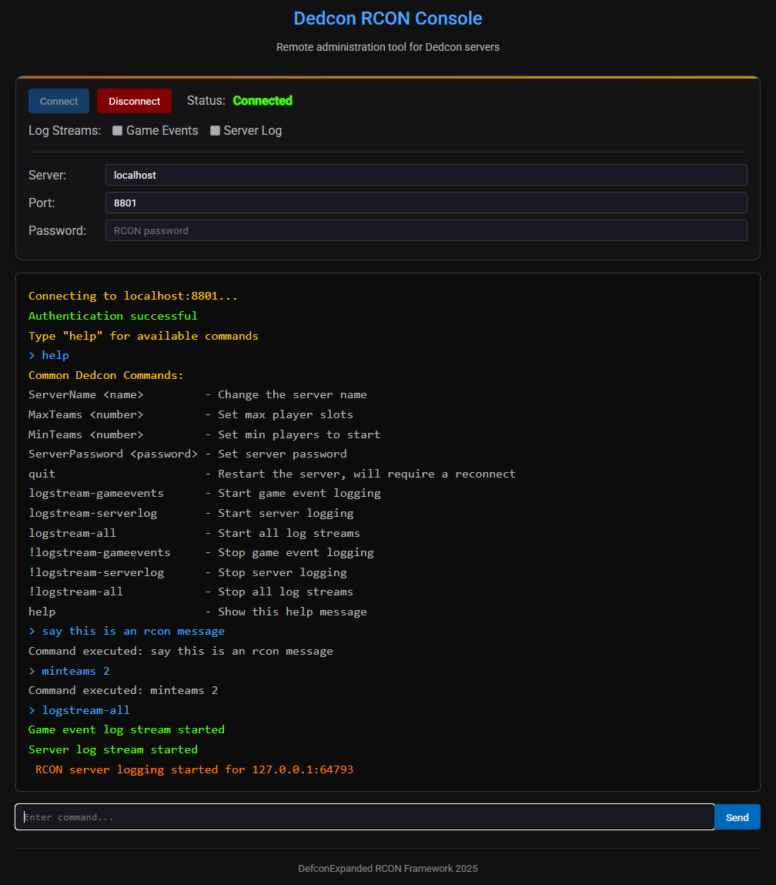

# DedconRCON Framework

A modern framework for integrating RCON communication with Dedcon servers into web applications. This package supports the encrypted RCON protocol used by recent versions of Dedcon.
Would also like to let everyone know that DedconRCON does not use the RCON protocol used in other multiplayer games! the naming scheme was chosen due to that RCON is a widely recognised
remote access protocol.

This repository includes a comprehensive implementation for connecting to Dedcon servers through a web application and is meant to be a starting point.
You have permission to use all of these resources I have provided and modify them to your liking. I decided to use Node.js for the backend
implementation, however this is due to my preference. If you are a developer you will not find it hard to integrate this with your own website
using PHP, Django, or other frameworks.

## Example Screenshot



## Features

- **Secure Encrypted Communication** - Implements AES-256-GCM encryption for secure RCON communication
- **Modern Web Interface** - Simple web interface that is straight forward
- **Live Log Streaming** - Supports log streaming, so you can take a peek at what the server is actually doing
- **Automatic Reconnection** - Handles session timeouts and reconnection correctly

## Installation

1. Make sure you have Node.js installed (v14+ recommended)
2. Clone or download this repository
3. Install dependencies:

```bash
npm install
```

## Running the Server

Start the server with:

```bash
npm start
```

Or

```bash
node server.js
```

The server will run on http://localhost:3000 by default unless you create an Apache or Nginx configuration.

## Server Configuration

Before using this RCON console, make sure your Dedcon server has RCON enabled:

Add these lines to your server config file:

- `RCONEnabled 1`
- `RCONPort 8800` (The RCON port is configurable between 8800 and 8900)
- `RCONPassword your-secure-password`

## Encryption Details

The framework implements AES-256-GCM encryption with the following characteristics:

- **Key Derivation**: SHA-256 hash of the RCON password
- **Nonce**: Also known as Number Once, 12 bytes are randomly generated for each message
- **Authentication Tag**: 16 bytes, ensures message integrity
- **Magic Number**: "RCON" in hex (0x52434F4E) to identify encrypted packets
- **Packet Structure**: `magic + nonce + tag + ciphertext`

The encryption is extremely simple but effective, the last thing we want is passwords sent over the internet in plain text

## Common RCON Commands

- `ServerName "New Name"` - Change server name
- `MaxTeams <number>` - Set maximum player slots
- `MinTeams <number>` - Set minimum players to start
- `ServerPassword <password>` - Set server password
- `quit` - Restart the server (this will also disconnect your session)

## Log Streaming Commands

The difference between the two matters since each logstream tells us different things about the server at runtime.
Which means that DedconRCON supports both gameevent logstreams and serverlog streams:

- `logstream-gameevents` - Start streaming gameevents
- `logstream-serverlog` - Start streaming serverlogs
- `logstream-all` - Start streaming both types of logs
- `!logstream-gameevents` - Stop streaming gameevents
- `!logstream-serverlog` - Stop streaming serverlogs
- `!logstream-all` - Stop streaming all logs

## Security Considerations

- This framework is designed for local use or secure networks. However if you are a developer you can deploy with Apache or Nginx.
- HTTPS is strongly recommended for production use, However DedconRCON's encryption should be safe enough to use without HTTPS
- Use a strong RCON password since there is no two factor, that password is a gateway to your Dedcon server.

## Project Structure

- `server.js` - Node.js server implementation with DedconRCON's encryption and packet structure in mind
- `public/index.html` - Web interface, simple but gets the job done
- `public/main.css` - CSS styles
- `public/index.js` - Frontend JavaScript

## Extending the Framework

The framework is designed to be easily extended:

- Create a customized interface by modifying the HTML and CSS files
- Add database integration to log commands and responses

## Contact

Any problems or issues you encounter with this implementation or DedconRCON itself, don't hesitate to contact me at:

keiron.mcphee1@gmail.com