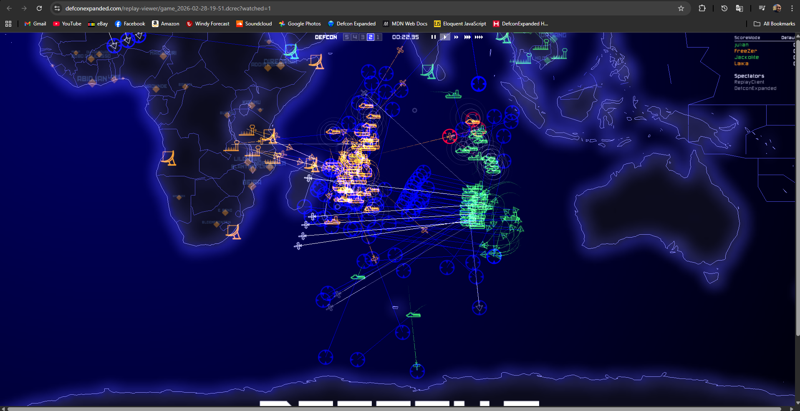
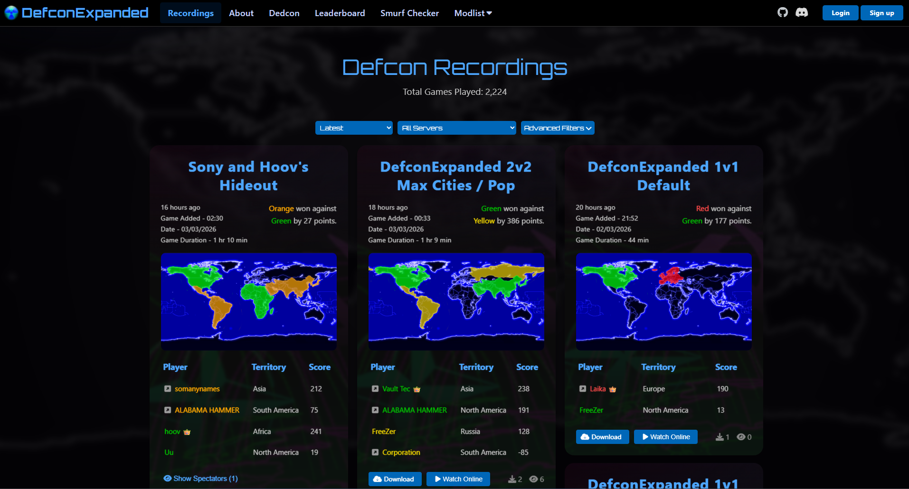

# DefconExpanded

## Defcon



My best attempt at modernizing and improving Defcon, most of the changes made have been internal/engine
changes which is not flashy. But brings the game upto speed with the times.
The biggest feature changes are as follows:

- Globe Mode
- Recording Playback
- DirectX11
- WebAssembly

The project is far from finished and has its own quirks and issues, however i do believe this is a much
better experience that people have currently on STEAM.

## Website



The website is the cherry on top which was my best attempt at creating an eco-system for Defcon in my vision.
It has alot of problems and to be honest it can be embarassing at times to show people it. But it has charm
and gets the job done.

Things that the website does:

- Store game recordings for download and playback via WebAssembly
- Contain a mod repository for all the known and indexed Defcon mods
- Leaderboard with seasons
- Contains a complicated admin interface allowing admins to manage Defcon servers

---

## Table of Contents

- [Defcon](#defcon)
  - [Building](#building)
    - [Windows (Native)](#windows-native)
    - [Linux (Native)](#linux-native)
    - [WebAssembly](#webassembly)
    - [MacOSX](#macosx)
  - [Testing Recordings](#testing-recordings)
  - [Troubleshooting](#troubleshooting)
- [Website](#website)
  - [Running](#running)
  - [Troubleshooting](#troubleshooting-1)

---

## Defcon

### Building

All dependencies are bundled in `contrib/` and do not require manual installation. **Python 3** and **CMake 3.16+** are required across all platforms.

#### Windows (Native)

Open the Visual Studio solution, currently targets the v145 toolset for VS 2026:

```
targets/msvc/game.sln
```

The solution targets **x64** only and includes six projects: `Defcon`, `SystemIV`, `Unrar`, `ImGui`, `Highway`, and `TinyGLTF`. All projects are built as static libraries that are linked against the Defcon executable. 

Select **Release** or **Debug** and build.

Output is written to `targets\msvc\Defcon Result\Release` or `targets\msvc\Defcon Result\Debug`.

---

#### Linux (Native)

Run the provided build script from the project root:

```bash
./build_linux.sh
```

Available options:


| Flag                   | Description                                      |
| ---------------------- | ------------------------------------------------ |
| `-d`, `--debug`        | Build in Debug mode (default: Release)           |
| `-i`, `--install-deps` | Install system dependencies (prompts for distro) |
| `-p`, `--package`      | Package the output as a `.tar.bz2` archive       |
| `-h`, `--help`         | Show usage information                           |


The script auto-detects your distribution and supports **Debian/Ubuntu**, **Arch Linux**, and **Fedora/RHEL**.

**Examples:**

```bash
# Release build
./build_linux.sh

# Debug build
./build_linux.sh --debug

# Release build with dependency installation
./build_linux.sh --install-deps

# Release build with .tar.bz2 packaging
./build_linux.sh --package

# Clean rebuild
rm -rf build && ./build_linux.sh
```

The script automatically detects whether `localisation/data/` files have changed and rebuilds `main.dat` only when necessary. To force a rebuild of `main.dat`, delete `localisation/.localisation_checksums`.

Output binary: `build/result/Release/defcon`

---

#### MacOSX

MacOSX is currently a mixed bag, it has been tested and working many times however without owning a Mac machine
myself, frequent testing and builds are not a thing currently.

CMakeLists.txt and the Xcode project both build without much trouble however its common for changes to break macOS
compilation as there is not a good way to test.

Both build methods produce a self-contained `DEFCON.app` bundle. The minimum deployment target is **macOS 10.13**.
SDL2, Ogg, and Vorbis frameworks are bundled in `contrib/systemIV/contrib/macosx/Frameworks/` and do not need to be installed separately.

---

**CMake**

From the project root, create a build directory and configure:

```bash
mkdir -p build/macos && cd build/macos
```

**Apple Silicon (arm64):**

```bash
cmake ../.. \
    -DCMAKE_BUILD_TYPE=Release \
    -DCMAKE_OSX_ARCHITECTURES=arm64
cmake --build . --parallel $(sysctl -n hw.logicalcpu)
```

**Intel (x86_64):**

```bash
cmake ../.. \
    -DCMAKE_BUILD_TYPE=Release \
    -DCMAKE_OSX_ARCHITECTURES=x86_64
cmake --build . --parallel $(sysctl -n hw.logicalcpu)
```

If `CMAKE_OSX_ARCHITECTURES` is not specified, CMake will auto-detect based on the host machines processor,
so you can probably skip the architecture step if you want.

#### WebAssembly

The WebAssembly build targets the website and produces `.wasm`, `.js`, and `.data` files deployed to `website/defcon/`.

Emscripten is bundled at `contrib/systemIV/contrib/emsdk/` and will be installed automatically on first run if not already activated.

**Windows:**

```bat
build_emscripten.bat
```

**Linux / macOS:**

```bash
./build_emscripten.sh
```

Both scripts prompt for **Release** or **Debug** and handle the full pipeline:

1. Installs and activates Emscripten SDK if needed
2. Configures the build with `emcmake` + Ninja
3. Compiles with `emmake`
4. Copies output files to `website/defcon/`
5. Renames the HTML file and updates the script tag to match the current version

---

### Testing Recordings

Defcon supports automated playback testing of `.dcrec` recording files to verify sync correctness across builds.
This is important if you plan to contribute and make changes, if your changes dont pass this step then throw them
away! if your intention is not to remain sync compatible then thats fine.

You can pass one or more recording files or a directory of recordings to the executable using the `-test-recording` flag:

```bash
# Test a single recording
./defcon -test-recording path/to/game.dcrec

# Test all recordings in a directory
./defcon -test-recording path/to/recordings/
```

Additional flags:


| Flag                   | Description                                                 |
| ---------------------- | ----------------------------------------------------------- |
| `-print-recording`     | Print recording event stream to the console during playback |
| `-dump-sync-at <tick>` | Dump the full sync log at the specified game tick           |
| `-write-results`       | Write test results to disk after playback completes         |


The test plays back each recording by launching up an internal server and client, then verifies sync values from the client match the multiplayer clients from the recordings.

---

### Troubleshooting

**Emscripten configuration fails (WebAssembly)**

If `emcmake` configuration fails, try deleting the build directory and retrying:

```bash
# Linux/macOS
rm -rf build/wasm-defcon-release
./build_emscripten.sh

# Windows
rmdir /s /q build\wasm-defcon-release
build_emscripten.bat
```

If Emscripten is not activating correctly, manually install it:

```bash
cd contrib/systemIV/contrib/emsdk
python3 emsdk.py install latest
python3 emsdk.py activate latest
source emsdk_env.sh
```

**HTML version update fails after a WebAssembly build**

If the automatic HTML version update step fails, apply the changes manually:

1. Rename `website/defcon/defcon_*.html` to match the new version number
2. Update the `<script>` tag inside the HTML file to reference the new `.js` filename

Or just do what everbody else does and delete the build folder and rebuild :)

---

## Website

The website is a **Node.js / Express** server backed by a **MySQL** database. It must be running to use the WebAssembly version of Defcon. The `.wasm` files are served directly from it.

### Running

**Prerequisites**

- [Node.js](https://nodejs.org/) (v24+ required)
- MySQL or MariaDB with a database created for the project

**1. Install dependencies**

Run this once from the `website/` directory:

```bash
cd website
npm install
```

**2. Configure the environment**

A .env file is required to run the website, you can create one yourself with your own
values if you want. But i would recommend stubbing it out if you just want to run the
node server for using the WebAssembly Defcon.

**3. Start the server**

```bash
cd website
node node.js/server.js
```

The server will start on `http://localhost:3000` (or the port set in `.env`). On startup it prints the status of every environment variable and confirms the database connection. If you see `Hell yea` in the console, the `.env` loaded correctly :)